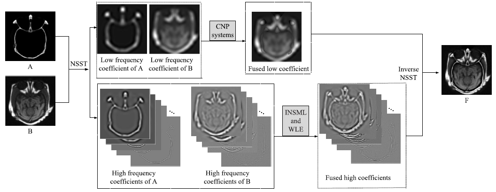
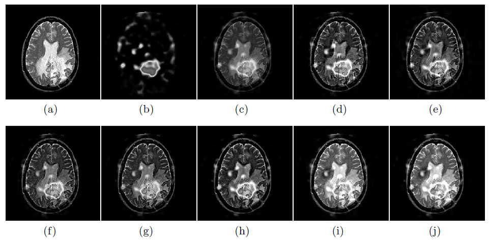

# Medical image fusion method based on coupled neural P systems in nonsubsampled shearlet transform domain
[Bo Li](https://github.com/MorvanLi/), Peng Hong*, Xiaohui Luo, Jun Wang, Mario J. Pérez-Jiménez, Agustín Riscos-Núñez.   
International Journal of Neural Systems (IF:5.9), Volume: 31,  2021  
[paper](https://www.worldscientific.com/doi/abs/10.1142/S0129065720500501)  

## Abstract

Coupled neural P (CNP) systems are a recently developed Turing-universal, distributed and parallel computing model, combining the spiking and coupled mechanisms of neurons. This paper focuses on how to apply CNP systems to handle the fusion of multi-modality medical images and proposes a novel image fusion method. Based on two CNP systems with local topology, an image fusion framework in nonsubsampled shearlet transform (NSST) domain is designed, where the two CNP systems are used to control the fusion of low-frequency NSST coefficients. The proposed fusion method is evaluated on 20 pairs of multi-modality medical images and compared with seven previous fusion methods and two deep-learning-based fusion methods. Quantitative and qualitative experimental results demonstrate the advantage of the proposed fusion method in terms of visual quality and fusion performance.

## Platform

matlab 2017b 

In 'main.m' file, you can run the code.

## Proposed framework



If you have any question about this code, feel free to reach me(morvanli1995@gmail.com) 

## Experiments



## Citation

````
@article{2020Medical,
  title={Medical Image Fusion Method Based on Coupled Neural P Systems in Nonsubsampled Shearlet Transform Domain},
  author={ Li, B. and Hong, P and  Luo, X.  and  Wang, J.  and  Riscos-Nunez, A. },
  journal={International Journal of Neural Systems},
  year={2020},
}
````

## Related Work

- Multi-focus image fusion based on dynamic threshold neural P systems and surfacelet transform[J]. Knowledge-Based Systems, 2020, 196, 105794.
  
  https://doi.org/10.1016/j.knosys.2020.105794
  
  
  
- A novel fusion method based on dynamic threshold neural P systems and nonsubsampled contourlet transform for multi-modality medical images[J] . Signal Processing, 2021, 178, 107793.

  https://doi.org/10.1016/j.sigpro.2020.107793

